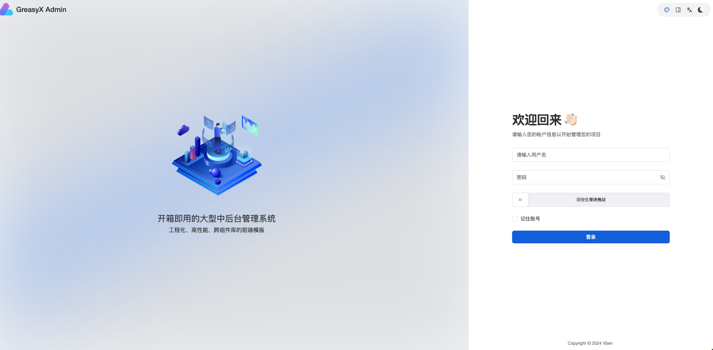
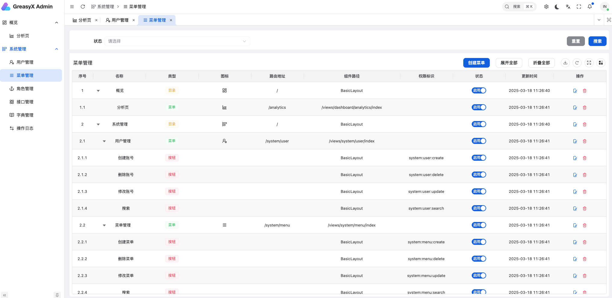
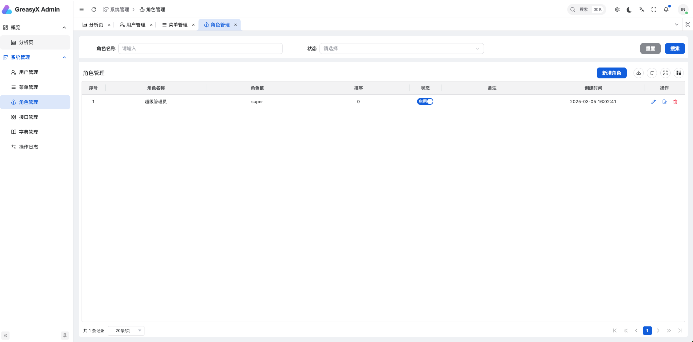
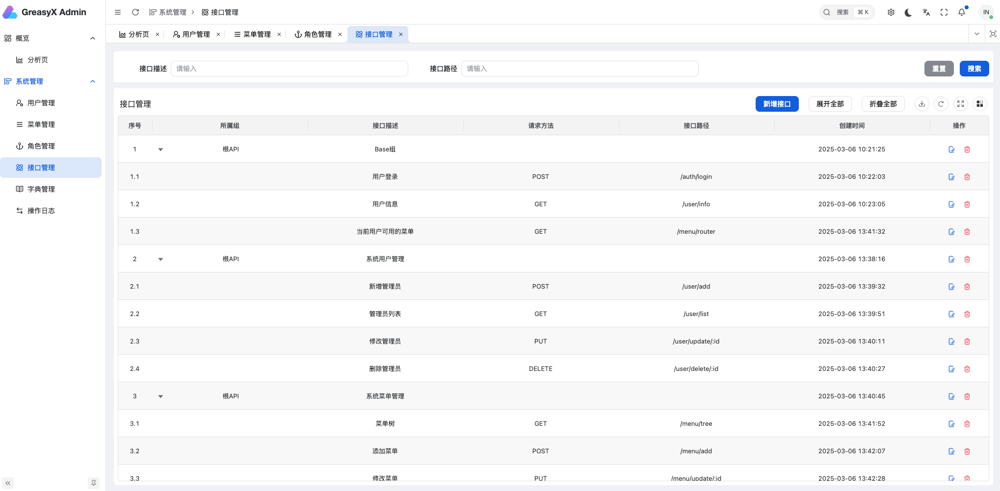
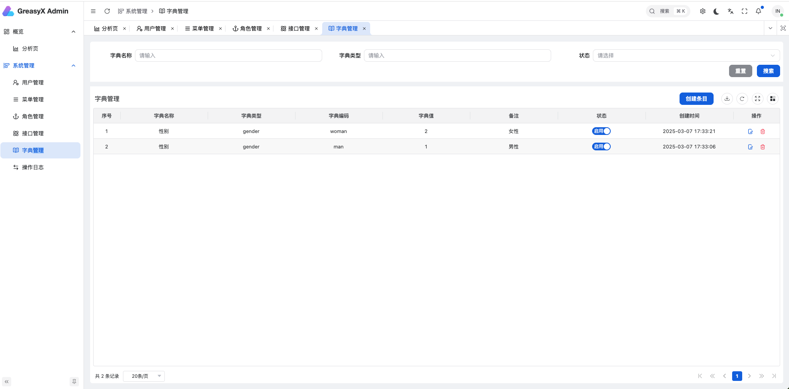
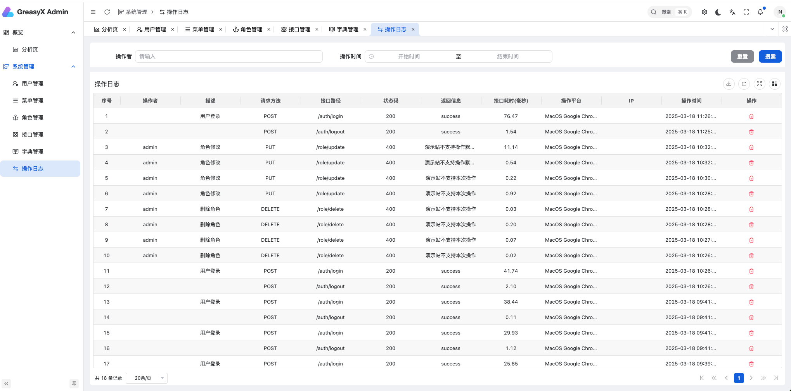

<h1 align="center">GreasyX Admin</h1>

 基于 vue-vben-admin (Element-plus) +后端 Go(Gin、gorm) 实现的管理后台

实现了用户、菜单、角色、API 权限管理；后端接口可快速移植至老项目中

 

## 介绍

> 后端介绍 [看这里](./greasyx-api/README.md)
>
> 前端直接使用的 `vue-vben-admin` [看这里](https://doc.vben.pro/)

 

## 演示地址

> 复制地址访问：http://8.137.16.100:5003/
>
> 默认账号密码: `admin` / `admin`
>
> 注意 📢：该账号下的数据都不可操作，你可以新建账号操作

 

## 技术栈

-   后端基于 Golang + Gin + Gorm

> 权限基于 `Casbin` 实现

-   前端基于 Vue3 + TypeScript + Element-plus + Vben Admin

 

## 功能列表

> 详细功能可访问演示站进行使用

-   用户登录

-   菜单管理

-   角色管理

-   接口管理

-   字典管理

-   操作日志

